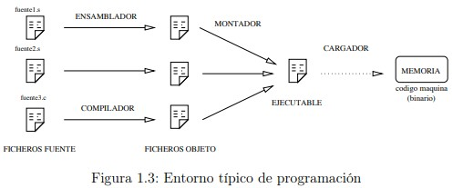

## **1.1.1. Características generales de la arquitectura ARM**

ARM es una arquitectura RISC (Reduced Instruction Set Computer=Ordenador
con Conjunto Reducido de Instrucciones) de 32 bits, salvo la versión del core ARMv8-
A que es mixta 32/64 bits (bus de 32 bits con registros de 64 bits). Se trata de una
arquitectura licenciable, quiere decir que la empresa desarrolladora ARM Holdings
diseña la arquitectura, pero son otras compañías las que fabrican y venden los chips,
llevándose ARM Holdings un pequeño porcentaje por la licencia.


**Registros**
La arquitectura ARMv6 presenta un conjunto de 17 registros (16 principales más
uno de estado) de 32 bits cada uno.


**Registros Generales.** Su función es el almacenamiento temporal de datos. Son los
13 registros que van R0 hasta R12.
**Registros Especiales.** Son los últimos 3 registros principales: R13, R14 y R15.
Como son de propósito especial, tienen nombres alternativos.
  - **SP/R13.** Stack Pointer ó Puntero de Pila. Sirve como puntero para almacenar variables locales y registros en llamadas a funciones.
  - **LR/R14.** Link Register ó Registro de Enlace. Almacena la dirección de
retorno cuando una instrucción BL ó BLX ejecuta una llamada a una
rutina.
  - **PC/R15.** Program Counter ó Contador de Programa. Es un registro que
indica la posición donde está el procesador en su secuencia de instrucciones. Se incrementa de 4 en 4 cada vez que se ejecuta una instrucción,
salvo que ésta provoque un salto.


**Registro CPSR.** Almacena las banderas condicionales y los bits de control. Los
bits de control definen la habilitación de interrupciones normales (I), interrupciones rápidas (F), modo Thumb 1
(T) y el modo de operación de la CPU.
Existen hasta 8 modos de operación, pero por ahora desde nuestra aplicación
sólo vamos a trabajar en uno de ellos, el Modo Usuario. Los demás son modos
privilegiados usados exclusivamente por el sistema operativo.
Desde el Modo Usuario sólo podemos acceder a las banderas condicionales,
que contienen información sobre el estado de la última operación realizada
por la ALU. A diferencia de otras arquitecturas en ARMv6 podemos elegir
si queremos que una instrucción actualice o no las banderas condicionales,
poniendo una “s” detrás del nemotécnico 
Existen 4 banderas y son las
siguientes:
  - **N.** Se activa cuando el resultado es negativo.
  - **Z.** Se activa cuando el resultado es cero o una comparación es cierta.
  - **C.** Indica acarreo en las operaciones aritméticas.
  - **V.** Desbordamiento aritmético.


## 1.1.2. El lenguaje ensamblador
El ensamblador es un lenguaje de bajo nivel que permite un control directo de
la CPU y todos los elementos asociados. Cada línea de un programa ensamblador
consta de una instrucción del procesador y la posición que ocupan los datos de esa
instrucción.
El ensamblador presenta una serie de ventajas e inconvenientes con respecto a
otros lenguajes de más alto nivel. Al ser un lenguaje de bajo nivel, presenta como
principal característica la flexibilidad y la posibilidad de acceso directo a nivel de
registro. En contrapartida, programar en ensamblador es laborioso puesto que los
programas contienen un número elevado de líneas y la corrección y depuración de
éstos se hace difícil.
Generalmente, y dado que crear programas un poco extensos es laborioso, el
ensamblador se utiliza como apoyo a otros lenguajes de alto nivel para 3 tipos de
situaciones:
- Operaciones que se repitan un número elevado de veces.
- Cuando se requiera una gran velocidad de proceso.
- Para utilización y aprovechamiento de dispositivos y recursos del sistema.

## 1.1.3. El entorno
Los pasos habituales para hacer un programa (en cualquier lenguaje) son los
siguientes: lo primero es escribir el programa en el lenguaje fuente mediante un editor de programas. El resultado es un fichero en un lenguaje que puede entender el
usuario, pero no la máquina. Para traducirlo a lenguaje máquina hay que utilizar
un programa traductor. Éste genera un fichero con la traducción de dicho programa,
pero todavía no es un programa ejecutable. Un fichero ejecutable contiene el programa traducido más una serie de códigos que debe tener todo programa que vaya a ser
ejecutado en una máquina determinada. Entre estos códigos comunes se encuentran
las librerías del lenguaje. El encargado de unir el código del programa con el código
de estas librerías es un programa llamado montador (linker) que genera el programa
ejecutable.





-----
### Listado 1.1: Código del programa intro1.s
```s
.data
var1 : .word 3
var2 : .word 4
var3 : .word 0x1234
.text
.global main
main : ldr r1, puntero_var1 /* r1 <- & var1 */
       ldr r1, [ r1 ] /* r1 <- *r1 */
       ldr r2, puntero_var2 /* r2 <- & var2 */
       ldr r2, [ r2 ] /* r2 <- *r2 */
       ldr r3, puntero_var3 /* r3 <- & var3 */
       add r0, r1, r2 /* r0 <- r1 + r2 */
       str r0, [ r3 ] /* *r3 <- r0 */
       bx lr
puntero_var1 : .word var1
puntero_var2 : .word var2
puntero_var3 : .word var3

```

### Listado 1.2: Código del programa intro2.s


```s
.data
var1 : .byte 0b00110010
.align
var2 : .byte 0b11000000
.align
.text
.global main
main : ldr r1, = var1 /* r1 <- & var1 */
       ldrsb r1, [ r1 ] /* r1 <- *r1 */
       ldr r2, = var2 /* r2 <- & var2 */
       ldrsb r2, [ r2 ] /* r2 <- *r2 */
       add r0, r1, r2 /* r0 <- r1 + r2 */
       bx lr
```

### Listado 1.3: Código del programa intro3.s

```s
.text
.global main
main : mov r2, # 0b11110000 /* r2 <- 11110000 */
       mov r3, # 0b10101010 /* r3 <- 10101010 */
       and r0, r2, r3 /* r0 <- r2 AND r3 */
       orr r1, r2, r3 /* r1 <- r2 OR r3 */
       mvn r4, r0 /* r4 <- NOT r0 */
       mov r0, # 0x80000000
       tst r0, # 0x80000000
       tst r0, # 0x40000000
       bx lr
```

### Listado 1.4: Código del programa intro4.s
```s
.data
var1 : .word 0x80000000
.text
.global main
main : ldr r0, = var1 /* r0 <- & var1 */
       ldr r1, [ r0 ] /* r1 <- *r0 */
       LSRs r1, r1, #1 /* r1 <- r1 LSR #1 */
       LSRs r1, r1, #3 /* r1 <- r1 LSR #3 */
       ldr r2, [ r0 ] /* r2 <- *r0 */
       ASRs r2, r2, #1 /* r2 <- r2 ASR #1 */
       ASRs r2, r2, #3 /* r2 <- r2 ASR #3 */
       ldr r3, [ r0 ] /* r3 <- *r0 */
       RORs r3, r3, # 31 /* r3 <- r3 ROL #1 */
       RORs r3, r3, # 31 /* r3 <- r3 ROL #1 */
       RORs r3, r3, # 24 /* r3 <- r3 ROL #8 */
       ldr r4, [ r0 ] /* r4 <- *r0 */
       msr cpsr_f, #0 /* C=0 */
       adcs r4, r4, r4 /* rotar izda carry */
       adcs r4, r4, r4 /* rotar izda carry */
       adcs r4, r4, r4 /* rotar izda carry */
       msr cpsr_f, # 0x20000000 /* C=1 */
       adcs r4, r4, r4 /* rotar izda carry */
       bx lr
```

### Listado 1.5: Código del programa intro5.s

```s
.data
var1 : .word 0x12345678
var2 : .word 0x87654321
var3 : .word 0x00012345
.text
.global main
main : ldr r0, = var1 /* r0 <- & var1 */
       ldr r1, = var2 /* r1 <- & var2 */
       ldr r2, = var3 /* r2 <- & var3 */
       ldrh r3, [ r0 ] /* r3 <- baja (* r0) */
       ldrh r4, [ r1 ] /* r4 <- baja (* r1) */
       muls r5, r3, r4 /* r5 <- r3*r4 */
       ldr r3, [ r0 ] /* r3 <- *r0 */
       ldr r4, [ r1 ] /* r4 <- *r1 */
       umull r5, r6, r3, r4 /* r6:r5 <- r3*r4 */
       smull r5, r6, r3, r4 /* r6:r5 <- r3*r4 */
       ldrh r3, [ r0 ] /* r3 <- baja (* r0) */
       ldr r4, [ r2 ] /* r4 <- *r2 */
       smulwb r5, r3, r4 /* r5 <- r3* baja (r4) */
       smultt r5, r3, r4 /* r5 <- alta (r3 )* alta (r4)*/
```

## 2.1.2. Tipos de datos
En la siguiente tabla se recogen los diferentes tipos de datos básicos que podrán aparecer en los ejemplos, así como su
tamaño y rango de representación.


**Punteros** 
Un puntero siempre ocupa 32 bits y contiene una dirección de memoria.
En ensamblador no tienen tanta utilidad como en C, ya que disponemos de registros
de sobra y es más costoso acceder a las variables a través de los punteros que directamente.

**Vectores** 
Todos los elementos de un vector se almacenan en un único bloque de
memoria a partir de una dirección determinada. Los diferentes elementos se almacenan en posiciones consecutivas, de manera que el elemento i está entre los i-1 e
i+1 (figura 2.1). Los vectores están definidos siempre a partir de la posición 0.

**Matrices bidimensionales** 
Una matriz bidimensional de N×M elementos se almacena en un único bloque de memoria. Interpretaremos una matriz de N×M como
una matriz con N filas de M elementos cada una. Si cada elemento de la matriz
ocupa B bytes, la matriz ocupará un bloque de M ×N ×B bytes


## 2.1.3. Instrucciones de salto
Las instrucciones de salto pueden producir saltos incondicionales (b y bx) o
saltos condicionales. Cuando saltamos a una etiqueta empleamos b, mientras que
si queremos saltar a un registro lo hacemos con bx. La variante de registro bx la
solemos usar como instrucción de retorno de subrutina, raramente tiene otros usos.

La lista completa de condiciones es ésta:
- **EQ (equal, igual).** Cuando Z está activo (Z vale 1).
- **NEQ (not equal, igual).** Cuando Z está inactivo (Z vale 0).
- **MI (minus, negativo).** Cuando N está activo (N vale 1).
- **PL (plus, positivo o cero).** Cuando N está inactivo (N vale 0).
- **CS/HS (carry set/higher or same, carry activo/mayor o igual).** Cuando C está activo (C vale 1).
- **CC/LO (carry clear/lower, carry inactivo/menor).** Cuando C está inactivo (C vale 0).
- **VS (overlow set, desbordamiento activo).** Cuando V está activo (V vale 1).
- **VC (overlow clear, desbordamiento inactivo).** Cuando V está inactivo (V vale 0).
- **GT (greater than, mayor en complemento a dos).** Cuando Z está inactivo y N=V (Z vale 0, N vale V).
- **LT (lower than, menor en complemento a dos).** Cuando N!=V (N vale not V).
- **GE (greater or equal, mayor o igual en complemento a dos).** Cuando N=V (N vale V).
- **LE (lower or equal, menor o igual en complemento a dos).** Cuando Z está activo y N!=V (Z vale 1, N vale not V).
- **HI (higher, mayor).** Cuando C está activo y Z inactivo (C vale 1, Z vale 0).
- **LS (lower or same, menor o igual).** Cuando C está inactivo ó Z activo (C vale 0 ó Z vale 1).

## 2.1.4. Estructuras de control de alto nivel
En este punto veremos cómo se traducen a ensamblador las estructuras de control
de alto nivel que definen un bucle (for, while, . . . ), así como las condicionales
(if-else).


#### Listado 2.1: Estructura del for y while en C (tipos1.c)

```c
int vi, vf, i;
for (i = vi; i <= vf; i++) {
  /* Cuerpo del bucle */
}
i = vi;
while (i <= vf) {
  /* Cuerpo del bucle */
  i++;
}
```

#### Listado 2.2: Traducción de las estructuras for y while.

```s
ldr r1, = vi
ldr r1, [ r1 ]
ldr r2, = vf
ldr r2, [ r2 ]
bucle : cmp r1, r2
bhi salir
        /* Cuerpo
        del
        bucle */
        add r1, r1, # 1
        b bucle
salir :
```

#### Listado 2.3: Estructura if en C (tipos2.c)

```c
int a, b;
if (a == b) {
  /* Código entonces */
} else {
  /* Código sino */
}
```

#### Listado 2.4: Traducción de la estructura if

```s
ldr r1, = a
ldr r1, [ r1 ]
ldr r2, =b
ldr r2, [ r2 ]
cmp r1, r2
bne sino
entonces :
/* Código entonces */
b final
sino :
/* Código sino */
final : ...
```
### 2.1.5. Compilación a ensamblador
Para acabar la teoría veamos cómo trabaja un compilador de C real. Normalmente los compiladores crean código compilado (archivos .o) en un único paso. En
el caso de gcc este proceso se hace en dos fases: en una primera se pasa de C a
ensamblador, y en una segunda de ensambladador a código compilado (código máquina). 


#### Listado 2.5: Código del programa tipos3.c

```c
# include < stdio.h >
  void main(void) {
    int i;
    for (i = 0; i < 5; i++) {
      printf(" %d\n ", i);
    }
  }
```

#### Listado 2.6: Código del programa tipos3a.s


```s
.data
var1 : .asciz " %d\ 012 "
.text
.global main
main :  push { r4, lr }
        mov r4, # 0
        .L2 : mov r1, r4
        ldr r0, = var1
        add r4, r4, # 1
        bl printf
        cmp r4, # 5
        bne .L2
        pop { r4, pc }
```

#### Listado 2.7: Código del programa tipos3b.s
```s
.data
var1 : .asciz " %d\ 012 "
.text
.global main
main :  push { r4, lr }
        mov r1, # 0
        ldr r4, = var1
        mov r0, r4
        bl printf
        mov r0, r4
        mov r1, # 1
        bl printf
        mov r0, r4
        mov r1, # 2
        bl printf
        mov r0, r4
        mov r1, # 3
        bl printf
        mov r0, r4
        mov r1, # 4
        pop { r4, lr }
        b printf
```
### 2.2.1. Suma de elementos de un vector
En este primer apartado, estudiaremos un bucle que calcula la suma de todos los
elementos de un vector. El vector se denomina vector y tiene 5 elementos de tipo
int (entero de 32 bits). 

#### Listado 2.8: Suma de elementos de un vector (tipos4.c)
```c
# include < stdio.h >
  void main(void) {
    int i, suma;
    int vector[5] = {
      128,
      32,
      100,
      -30,
      124
    };
    for (suma = i = 0; i < 5; i++) {
      suma += vector[i];
    }
    printf(" La suma es %d \n", suma);
  }
```

#### Listado 2.9: Suma de elementos de un vector (tipos4.s)

```s
.data
var1 : .asciz " La suma es %d \n"
var2 : .word 128, 32, 100, - 30, 124
.text
.global main
/* Salvamos registros */
main :  push { r4, lr }
/* Inicializamos variables y apuntamos r2 a var2 */
        mov r0, # 5
        mov r1, # 0
        ldr r2, = var2
/* Bucle que hace la suma */
        bucle : ldr r3, [ r2 ] , # 4
        add r1, r1, r3
        subs r0, r0, #1
        bne bucle
/* Imprimimos resultado */
        ldr r0, = var1
        bl printf
/* Recuperamos registros y salimos */
        pop { r4, lr }
        bx lr
```
#### Listado 2.10: Suma de un vector de enteros largos (tipos6.s)

```s
.data
var1 : .asciz " La suma es %lld \ n"
var2 : .word 1600000000, - 100, 800000000, - 50, 200
.text
.global main
/* Salvamos registros */
main :  push { r4, r5, r6, lr }
/* Inicializamos variables y apuntamos r4 a var2 */
        mov r5, # 5
        mov r2, # 0
        mov r3, # 0
        ldr r4, = var2
/* Bucle que hace la suma */
        bucle : ldr r0, [ r4 ] , # 4
        mov r1, r0, ASR # 31
        adds r2, r2, r0
        adc r3, r3, r1
        subs r5, r5, #1
        bne bucle
/* Imprimimos resultado */
        ldr r0, = var1
        bl printf
/* Recuperamos registros y salimos */
        pop { r4, r5, r6, lr }
        bx lr
```
